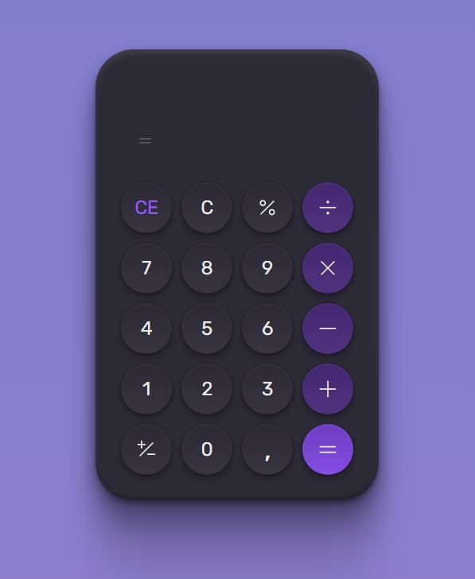

# <h1 style="text-align:center">__#boraCodar__ 👩🏻‍🚀</h1>

#### <h3 style="text-align:center">Projeto semanal proposto pela RocketSeat no desafio #boraCodar.   Nesse desafio tenho buscado realmente me desafiar e desenvolver meu aprendizado. 🚀 </h3>

  

## 🚀 Tecnologias

Esse projeto foi desenvolvido com as seguintes tecnologias:

- HTML e CSS
- Javascript
- Git e Github

### <h2 style="text-align:center"> [Acesse meu perfil no Linkedin aqui](https://www.linkedin.com/in/bruno-dias-26685a243/) </h2>
